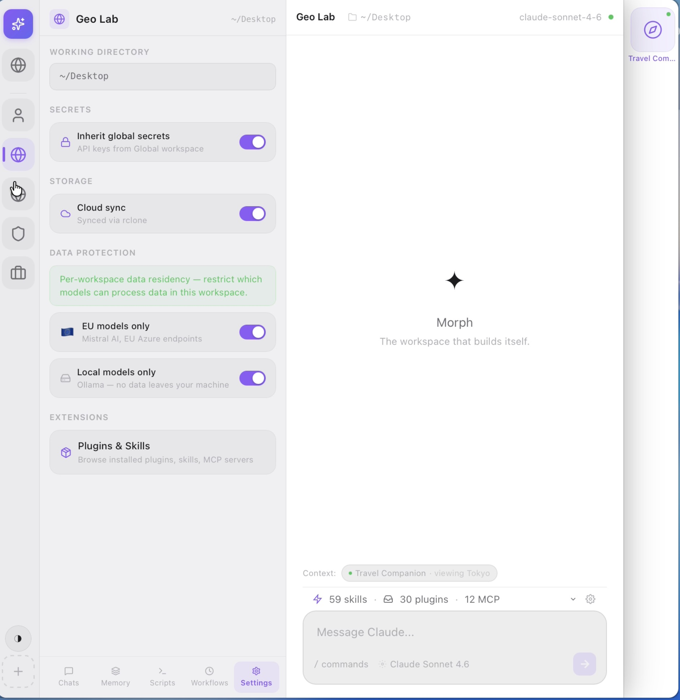
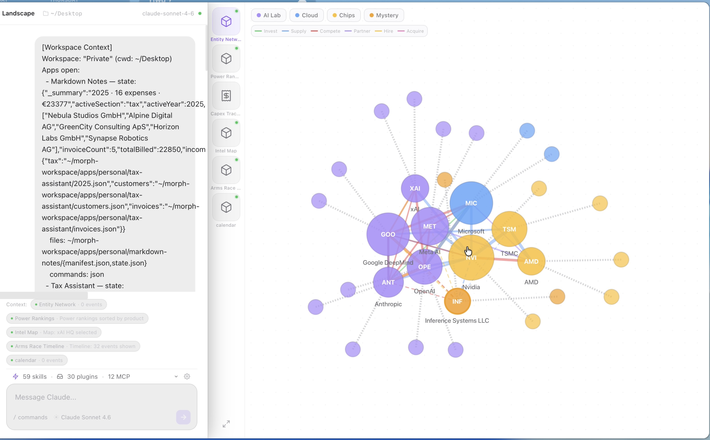
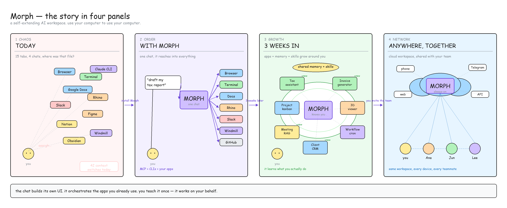
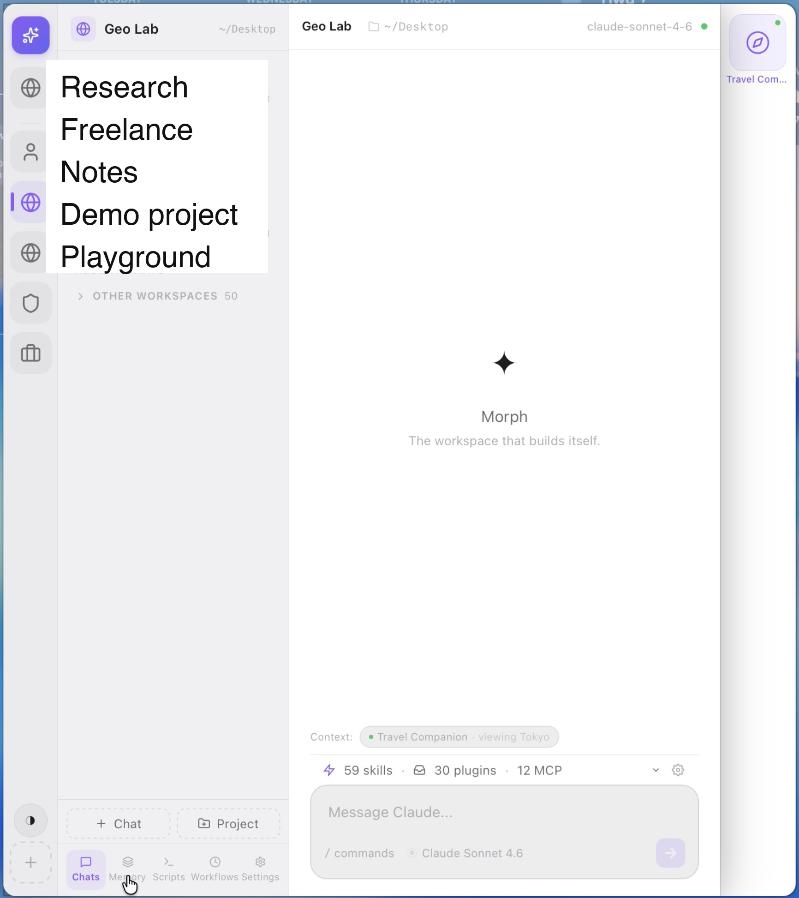
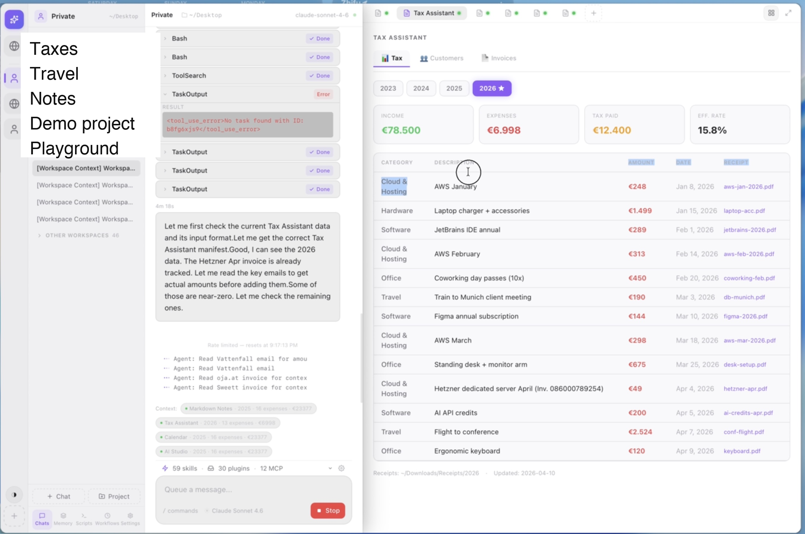
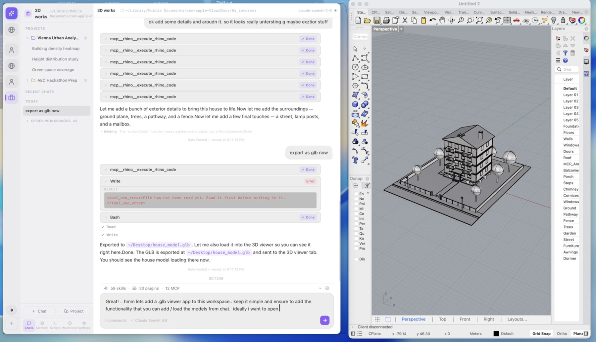

# Morph

### Use your computer to use your computer.

*A local-first AI workspace that builds itself, with you.*

<table>
  <tr>
    <td align="center" width="50%"></td>
    <td align="center" width="50%"></td>
  </tr>
  <tr>
    <td align="center"><sub>Base view, no app open. Per-workspace settings — default model, data residency, whether the workspace runs local or on the cloud arm.</sub></td>
    <td align="center"><sub>A "market developments" workspace with an entity-graph app open (one of six in this workspace). The chat has live access to the panel's data and the SQLite store behind it, and can act on both directly.</sub></td>
  </tr>
</table>

## The problem

I kept building pieces.

Started with a bunch of MacOS apps, then building my own. Then I moved to CLIs — scripts, skills, MCP servers. Chat as a control surface is faster than most UIs, and Claude Code became my default. But text isn't always enough. Sometimes you need a chart, an invoice preview, a 3D model, a receipts database.

So I stitched: a self-hosted Lovable-style deploy tool, a Windmill automation server, a file-transfer service, a dozen CLIs glued by shell scripts. Each piece worked. Together they became exhausting. **15 tabs to do one thing.** One for the chat, one for the automation, one for the hosted app, one for the file, one for the secret vault, one for… you get it.

The industry is racing the same way — Claude Code, Claude Desktop's Cowork mode, OpenAI Codex, Cursor. All good. None of them have cracked the piece I actually wanted: **a persistent workspace where the agent builds its own UI, that UI feeds state back into the chat, and the whole thing grows around you over time.**

So I built Morph.

## What it is

Morph is a desktop AI workspace where the chat is the cockpit. You talk to it. It orchestrates the apps you already use (Rhino, Blender, Terminal, Browser, Google Workspace, Notion) via MCP and CLIs. When a UI would actually help — a chart, a table, a map, a 3D viewer — the agent writes a React panel and mounts it as a tab next to the chat. The panel persists. Its state streams back into the conversation automatically.

Workspaces separate your life: taxes, client work, generative-AI experiments, private notes. Each one has its own memory, skills, secrets, and apps. A "mother" workspace holds global defaults that children can inherit.


<p align="center"><em>15 tabs → one chat that drives them → a workspace that grows around what you actually do → shared with your team or running on the cloud arm when you're offline.</em></p>

## Why this shape

**The cockpit stays, even when the models get good enough to work without one.**

As coding models get stronger, agents will write better and better UIs — that's fine. And as agents get more autonomous, you can dispatch them to the cloud arm, let them work against your workspace, and pull results back later — also fine. But you still want **one place** to go when you want to see what's happening, teach the agent something new, tweak an output, or decide what to do next.

Morph is that place. The cockpit.

## Key ideas

- **Chat-as-orchestrator.** One prompt. The agent reaches into your whole stack via MCP + CLIs.
- **Agent-built UI panels.** The agent writes React components. `esbuild-wasm` compiles them in the browser. They mount as persistent tabs. They talk back.
- **State feedback loop.** Every panel pushes its live state to the chat. No copy-paste. No re-explaining. This is the core differentiator.
- **Per-life workspaces.** Each with its own memory, skills, secrets, apps. Inheritance from a mother workspace for globals.
- **Standards-first extensibility.** Skills, Hooks, Subagents, MCP — same primitives as Claude Code and Cursor. Drop in what you already have.
- **Cloud arm, optional.** Always-on server instance for cron, triggers, webhooks, Telegram, published sites, and team sharing. Same workspace, different surface.
- **Vertical container stacks** (roadmap). Pre-installed domain containers (geo, ML, data, design, finance) turn Morph into an operating system for a specific industry.
- **Cannibalise tools at your pace.** If Gmail is good enough, use it. If you want to cannibalise it into a custom inbox panel that understands your life, do that too.
- **Security + audit by architecture.** Per-workspace scoped secrets, encrypted SQLite on the server, hash-chain audit trail, capability gates.
- **Model choice is the plan.** This demo ships with Claude Agent SDK. The roadmap swaps in [`rig-core`](https://github.com/0xPlaygrounds/rig) for multi-provider + BYOK + local Ollama.

## See it

<table>
  <tr>
    <td align="center" width="50%"><strong>Empty state — chat is the interface.</strong></td>
    <td align="center" width="50%"><strong>The agent built you a tax assistant.</strong></td>
  </tr>
  <tr>
    <td align="center"></td>
    <td align="center"></td>
  </tr>
  <tr>
    <td align="center"><strong>Orchestrating Rhino via MCP.</strong></td>
    <td align="center"><strong>Data-viz panels on demand.</strong></td>
  </tr>
  <tr>
    <td align="center"></td>
    <td align="center"></td>
  </tr>
</table>

## Compared to

Everyone's converging on agentic desktops — Claude Cowork, OpenAI Codex, OpenClaw. They all generate *something* UI-ish (Artifacts, in-app browser pages, a Live Canvas). Morph's bet is the shape none of them ship: **many persistent, agent-authored React tabs, compiled in-browser, each feeding live state back into the chat on every turn.** Workspace-as-first-class, not artifact-as-sidecar.

<table>
  <thead>
    <tr>
      <th align="left"></th>
      <th align="center">Morph</th>
      <th align="center">Claude Cowork</th>
      <th align="center">OpenAI Codex</th>
      <th align="center">OpenClaw</th>
    </tr>
  </thead>
  <tbody>
    <tr>
      <td>Agent generates interactive UI</td>
      <td align="center">✅ <sub>React, compiled in-browser</sub></td>
      <td align="center">⚠ <sub>Artifacts / Apps in chat</sub></td>
      <td align="center">⚠ <sub>in-app browser pages</sub></td>
      <td align="center">✅ <sub>A2UI declarative JSON</sub></td>
    </tr>
    <tr>
      <td>Persistent as workspace tabs</td>
      <td align="center">✅ <sub>many tabs, survive restart</sub></td>
      <td align="center">❌ <sub>projects ≠ workspaces</sub></td>
      <td align="center">❌</td>
      <td align="center">⚠ <sub>single canvas slot</sub></td>
    </tr>
    <tr>
      <td>UI ↔ chat bidirectional state</td>
      <td align="center">✅ <sub>auto, every turn</sub></td>
      <td align="center">⚠ <sub>only if coded</sub></td>
      <td align="center">⚠ <sub>page-level comments</sub></td>
      <td align="center">✅ <sub>by protocol</sub></td>
    </tr>
    <tr>
      <td>Local-first, offline-capable</td>
      <td align="center">✅</td>
      <td align="center">❌</td>
      <td align="center">⚠</td>
      <td align="center">✅</td>
    </tr>
    <tr>
      <td>Always-on cloud agent</td>
      <td align="center">planned</td>
      <td align="center">✅</td>
      <td align="center">✅</td>
      <td align="center">✅</td>
    </tr>
    <tr>
      <td>Multi-model / BYOK</td>
      <td align="center">planned</td>
      <td align="center">❌</td>
      <td align="center">❌</td>
      <td align="center">✅</td>
    </tr>
    <tr>
      <td>Open source</td>
      <td align="center">MIT</td>
      <td align="center">❌</td>
      <td align="center">Apache-2.0</td>
      <td align="center">MIT</td>
    </tr>
    <tr>
      <td>Shipping today</td>
      <td align="center">demo</td>
      <td align="center">GA</td>
      <td align="center">GA</td>
      <td align="center">stable</td>
    </tr>
  </tbody>
</table>

<sub>✅ full · ⚠ partial · ❌ not shipped. Verified against public docs and release notes for Cowork (GA 2026-04-09), the "new Codex" desktop update (2026-04-16/17), and OpenClaw 2026.4.15 (2026-04-16).</sub>

## Architecture

Tauri 2 shell + React 19 + Zustand. A Node sidecar hosts the Claude Agent SDK. On launch, the sidecar opens a localhost WebSocket and announces its port on stdout; the Rust side reads that line once and then all traffic is WS JSON. `esbuild-wasm` compiles agent-written `.tsx` panels in the browser in ~40ms and mounts them in-process — no iframes, shared React context, `window.Morph` as the bridge.

The cloud arm (planned, not built in this demo) runs the same `morph-core` on a headless axum server: scoped-token auth, encrypted-SQLite secret store, Docker Engine for container stacks, trigger engine + DAG runner for deterministic + AI-mixed workflows.

Full write-up: [`docs/architecture.md`](docs/architecture.md). Diagrams: [`docs/diagrams/`](docs/diagrams/).

## What's in this demo

- [x] Desktop app (Tauri 2)
- [x] Chat streaming via Claude Agent SDK
- [x] Agent-generated React panels, esbuild-wasm compile, in-process mount
- [x] Panel ↔ agent state feedback (`window.Morph.updateContext`)
- [x] Workspaces with per-workspace filesystem and memory
- [x] MCP + CLI orchestration hooks
- [x] ~15 example apps (tax, calendar, markdown notes, 3D viewer, entity graph, competitive intel, …)

## What's designed but NOT built here

- [ ] Cloud arm (server binary, triggers, DAGs, Telegram, webhooks, published sites)
- [ ] Vertical container stacks (geo / ML / data / design / finance)
- [ ] Shared workspaces / multi-user
- [ ] Sync engine (rclone-based)
- [ ] Self-hosted model routing (rig-core)
- [ ] Full Skills / Hooks / Subagents surface

## Tech stack

| Layer | Choice |
|-------|--------|
| Shell | Tauri 2 (Rust) |
| UI | React 19 + Tailwind v4 |
| State | Zustand |
| Agent | Claude Agent SDK (Node sidecar) |
| Compiler | `esbuild-wasm` in the renderer |
| Bridge | localhost WebSocket (port announced via stdout) + Tauri IPC |
| Roadmap | `rig-core`, `axum`, rclone, container stacks |

## Running locally

```bash
git clone https://github.com/SerjoschDuering/morph-demo
cd morph-demo
npm install
npm run tauri dev
```

Requires:
- Node 20+, Rust (stable), Xcode Command Line Tools (macOS)
- **Claude Code CLI installed and authenticated** at `~/.claude/` (the sidecar reads the Claude Agent SDK session from there; an API key alone won't work)

First run takes 2–3 minutes to compile the Rust side.

## Status — this is a demo

Sloppy code, rough UX. This exists to timestamp an idea and show that the core loop closes: **chat writes panel → panel mounts → panel informs chat → chat acts.** Workspaces isolate. MCP orchestrates. The shape of the thing is real.

The code is less interesting than the idea. If the shape resonates, open an issue — I'm more interested in the conversation than the code.

## License

MIT — see [LICENSE](LICENSE).

## Credits

Built by [@SerjoschDuering](https://github.com/SerjoschDuering). Powered by [Claude Agent SDK](https://docs.anthropic.com/en/docs/agents-and-tools/claude-code/sdk) and [Tauri](https://tauri.app).
