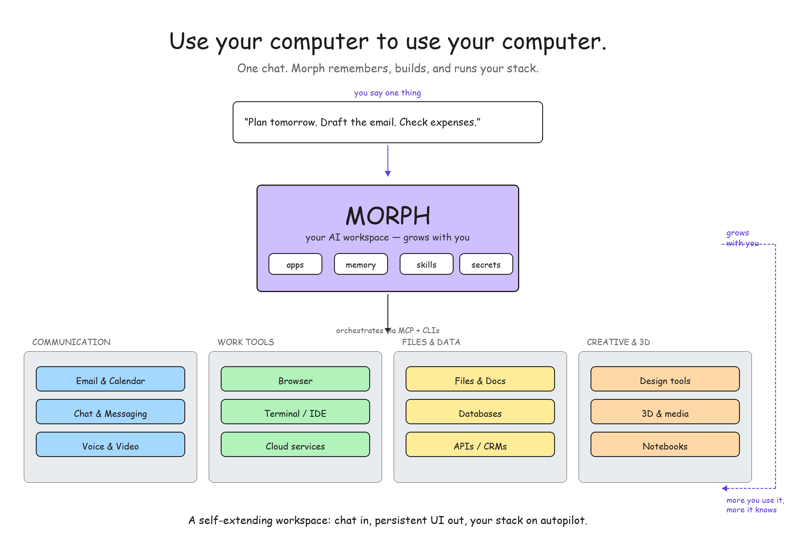
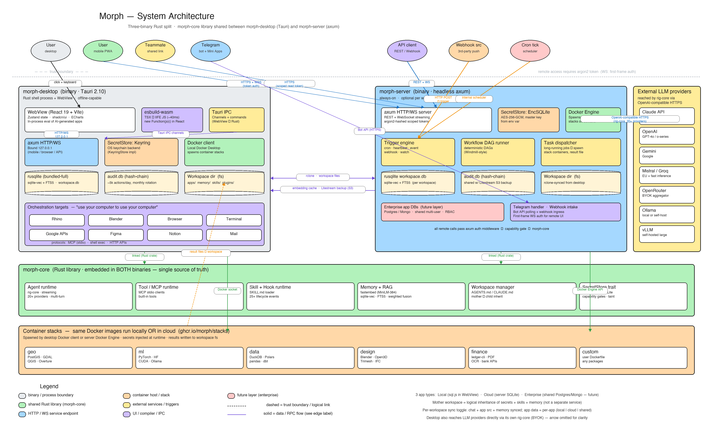

# Morph

**The AI workspace that grows around how you actually work.**

> Use your computer to use your computer.

---

I wanted one tool that could bring together everything I already use — the chat, the terminal, a browser, design software, my notes, my files, my email, a dozen CLIs and glue scripts — and quietly consolidate them into one place that learns my patterns.

A **virtual brain** I could keep talking to. One that builds its own interface over time, remembers what I taught it, and uses my computer the way I would.

Morph is my attempt at that.



## Why I'm building this

I'm a developer who'd rather build than subscribe. Over the last year I stitched together my own stack piece by piece:

- A self-hosted Lovable-style platform for deploying AI-coded apps online (so I'd stop clicking around HTML files lying on my laptop)
- A self-hosted automation server for cron jobs, webhooks, scheduled agents
- A self-hosted live-websites launcher for quick custom pages
- A self-hosted file-transfer service
- A growing pile of CLIs glued together with shell scripts

Each piece worked. Together they became exhausting. I'd open 15 tabs to do one thing — one for the automation, one for the hosted app, one for the files, one for the chat, one for the database, one for the secret vault.

Somewhere along the way **Claude Code became my default interface**. The chat was just faster than most UIs. Scripts, skills, CLIs, MCP — text is a great control surface.

But text isn't always enough. Sometimes you need to *see* a chart, preview an invoice, scrub a 3D model, map something. And when you need a UI, it can't be yet another floating tab — it has to be **part of the conversation**, sharing state both ways.

So here's the idea:

- **The chat is the orchestrator.** Everything feeds into it.
- **Workspaces organize your life.** Taxes, client work, generative-AI experiments, private projects — each with its own memory, skills, apps, and secrets.
- **The AI builds UIs when they help.** Persistent React panels, not throwaway tabs. They share context with the agent and evolve over time.
- **A cloud arm is always on.** Cron, triggers, webhooks, Telegram — same workspace you use locally, reachable from anywhere.
- **Secrets, storage, sharing are first-class.** Not glued on as an afterthought.
- **Model choice is yours.** Claude, GPT, Gemini, self-hosted Ollama — BYOK, swap freely.

Think of Morph as a **vertical, self-hosted take on Claude Cowork**: the more you use it, the more it cannibalises the tools around it — until your workspace *is* your workflow.

## What it does

Morph is a chat — but the chat is the control plane for **your whole stack**, and the interface evolves around you as you use it.

**It builds your workspace over time.** You don't set up apps. You use Morph, and the apps you need appear. A tax assistant the first time you file. An invoice generator when you take on a freelance gig. A map panel when you're reviewing a site. A model viewer when you open a `.glb`. Each one is a real React panel the agent wrote for you — persistent, reusable, tuned to how *you* work.

**It orchestrates what you already have.** Instead of asking you to migrate to a new tool, Morph drives the tools you already use — Rhino, Blender, your browser, your terminal, Google Workspace, Figma, your files — via MCP servers and CLIs. You stay in the chat. Morph does the clicking.

**Apps feed the chat, and the chat feeds the apps.** Every panel pushes its live state back into the conversation. The agent always has context — no copy-paste, no re-explaining. When it needs to push something back, it writes to the app and the app reacts.

**It consolidates your knowledge.** A markdown editor, a filesystem, shared memory, RAG — built-in and wired together by default. Today you glue Claude Code + Obsidian + a notes app + half a dozen scripts. Morph is the single place where all of it lives and reinforces itself.

**It grows with you.** The more you use it, the more it knows. Skills you teach stick. Memory accumulates. Workspaces branch off for each project. Over weeks, Morph stops being a tool you use and starts being the shape your work takes.

## See it in action

A clean workspace looks minimal — the chat is the interface. Everything grows from here.


Over time, app panels accumulate alongside the chat. Here's a tax-assistant panel the agent built and now maintains — rows it found in your receipts, live totals, and a context pill telling the chat what the panel currently holds.


Morph orchestrates the apps you already use. Here it's driving Rhino through an MCP server — capturing the viewport, writing a script, exporting a `.glb` — and showing the result in a 3D-viewer panel next to the chat.


When a panel is more useful than text, the agent builds one. This is a custom entity-network app it wrote to visualise a workspace of research notes — the panel reads workspace files, renders the graph, and feeds its selection state back into the chat.


## Privacy, data residency, and model choice

Each workspace has its own settings. You choose where data goes — local only, synced to your cloud instance, or shared with a team. You choose which models can process it — any provider, EU-only endpoints, or fully offline via Ollama. Secrets are per-workspace and can inherit from a global vault.


## The story in four panels


From 15 tabs and a stack of CLIs → one chat that reaches into them → a workspace that grows around what you actually do → sharable with your team or a cloud instance that runs even when you're offline.

## Architecture



A Tauri 2 desktop shell wraps a React 19 frontend. A Node sidecar hosts the Claude Agent SDK. When the agent writes a `.tsx` source file, `esbuild-wasm` compiles it in the browser in ~40ms and the app mounts in-process — no iframes, shared React context, `window.Morph` as the bridge.

An optional **cloud arm** runs the same core on a server: triggers, cron, webhooks, always-on agents, Telegram bot, shared workspaces for a team. You decide per-workspace what lives where.

See [`docs/architecture.md`](docs/architecture.md) for the written version.

## Features in this demo

- [x] Local desktop app (Tauri 2)
- [x] Chat panel streaming from Claude Agent SDK
- [x] AI-generated React apps, compiled in-browser with esbuild-wasm
- [x] In-process app rendering (not iframes) — shared React context
- [x] App state feedback loop (`window.Morph.updateContext`)
- [x] Multiple workspaces with their own filesystem and memory
- [x] MCP + CLI orchestration hooks
- [x] 14 example apps — tax assistant, 3D viewer, calendar, markdown editor, signal feed, kanban, …
- [ ] Cloud arm (design done, not built)
- [ ] Telegram / mobile surfaces (planned)
- [ ] Skills, Hooks, Subagents — following the standards (partial)
- [ ] Shared workspaces / multi-user (planned)
- [ ] Sync engine (rclone-based, planned)
- [ ] Self-hosted model routing (planned, rig-core under the hood)

## Tech stack

| Layer | Choice |
|-------|--------|
| Shell | Tauri 2 (Rust) |
| UI | React 19 + Tailwind v4 |
| State | Zustand |
| Agent | Claude Agent SDK (Node sidecar) |
| Compiler | `esbuild-wasm` in the renderer |
| Bridge | stdio JSON-RPC + Tauri IPC |
| Planned | `rig-core` (multi-provider), `axum` (server arm), rclone (sync) |

## Running locally

```bash
git clone https://github.com/SerjoschDuering/morph-demo
cd morph-demo
npm install
npm run tauri dev
```

Requires: Node 20+, Rust (stable), Xcode CLI Tools (macOS), Claude Code configured at `~/.claude/`.

First run downloads `esbuild-wasm` and builds the Rust side — expect 2–3 minutes.

## Status — this is a demo

**This is a simple demo, not a product.** It exists to timestamp an idea and show the thesis works.

Sloppy code, rough UX, 80% of the envisioned features missing or stubbed. The cloud arm, sync, mobile surfaces, multi-user, and most of the standards integration are design-complete but unbuilt.

What it *does* prove: the loop closes. The chat can write a panel, the panel mounts live, the panel informs the chat, the chat acts. Workspaces isolate. MCP orchestrates. The shape of the thing is real.

If that shape resonates, open an issue — I'm interested in the conversation more than the code.

## License

MIT — see [LICENSE](LICENSE).

## Credits

Built by [@SerjoschDuering](https://github.com/SerjoschDuering). Powered by [Claude Agent SDK](https://docs.anthropic.com/en/docs/agents-and-tools/claude-code/sdk) and [Tauri](https://tauri.app).
